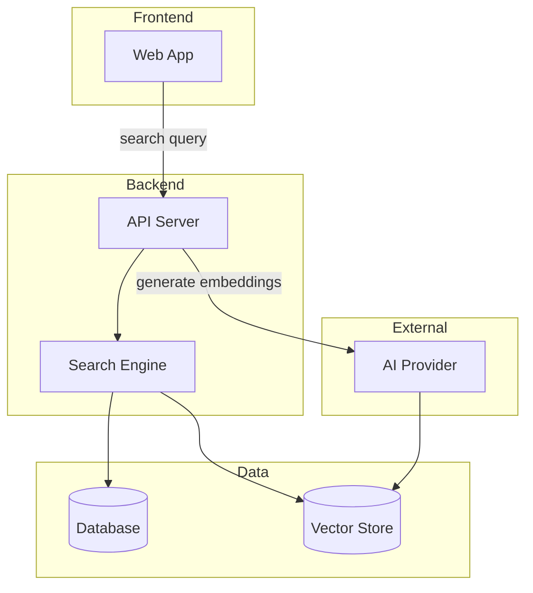

# arch-map

Generates a layman-readable architecture document from any codebase.

**This is a communication artifact, not a resume artifact.** It is human-facing —
shareable with stakeholders, contributors, and non-technical collaborators. It lives
at `docs/ARCHITECTURE.md` and is never auto-loaded by context-manager.

---

## Step 1 — Detect mode

| Mode | When |
|---|---|
| **GENERATE** | No `docs/ARCHITECTURE.md` exists, or user wants to rebuild from scratch |
| **UPDATE** | File exists, architecture has changed, user wants to refresh it |

For UPDATE: read the existing file first. Change only what actually changed — surgical edits.

---

## Step 2 — Audit the codebase

Read in this order. Stop when you can answer all five questions below.

1. `README.md` — what does this project say it does?
2. Package manifest (`package.json`, `requirements.txt`, `go.mod`, `Cargo.toml`, `pyproject.toml`) — what tech is in use?
3. Project root structure — what are the top-level folders and their purpose?
4. Entry points — `main.*`, `index.*`, `app.*`, `server.*`, `routes.*`
5. `git log --oneline -10` — what has been worked on recently?
6. `docs/context/` — if context-manager is set up, skim domain files for architecture notes and the reference file (`{domain}-ref.md`) for what/how/why/where

**Five questions to answer before writing:**

1. What does this product do? (one sentence, no jargon, a 10-year-old could understand it)
2. What are the main components? (frontend, backend, database, workers, external APIs)
3. How do components connect? (what calls what, what data moves between them)
4. What does a user's single most important action trigger, end-to-end?
5. Why was each major tech choice made? (if known — do not guess)

If question 5 is unclear for any component, write "—" in the Why column. Do not invent rationale.

---

## Step 3 — Write docs/ARCHITECTURE.md

Create or update `docs/ARCHITECTURE.md` using this exact structure:

```markdown
# [Project Name] — Architecture

> Last updated: {YYYY-MM-DD}
> For AI session context, see `docs/context/`. This file is for humans.

## What this is

{1–2 sentences. Plain English. No jargon. What problem does this solve and who uses it?}

## System map

{Mermaid diagram — see rules below}

## How it works — step by step

Walk through the single most important user action (the one that touches the most components):

1. User {does what}
2. {Component A} receives the request and {does what}
3. {Component B} {does what}, querying {Component C} for {what}
4. Result returns to the user as {what the user sees}

Keep it to 4–8 steps. Plain English labels only.

## Tech stack

| Layer | Technology | Why |
|---|---|---|
| {layer} | {tech} | {one line — why this, not something else} |

## Key constraints

Non-obvious rules that shape every decision in this codebase:

- **{constraint name}**: {what it is and why it matters}

## What is not built yet

{Only include if there are known significant gaps. Skip this section if nothing notable is missing.}
```

---

## Mermaid diagram rules

- Use `graph TD` (top-down) for most projects
- Use `graph LR` (left-right) if the flow is a clear pipeline (ingest → process → store → serve)
- Use `subgraph` to group related components: `subgraph Frontend`, `subgraph Backend`, `subgraph Data`
- Label nodes with plain English: `SearchUI[Search UI]` not `SearchUI[pgvector HNSW]`
- Show data flow direction with arrows: `A -->|user query| B`
- Maximum 12 nodes — if more, group into subgraphs
- External services (APIs, payment, email) go in a separate subgraph: `subgraph External`

Example for a web app with search:


---

## Step 4 — Link from context

If `docs/context/pointers.md` exists, check if it already has an architecture link.
If not, add one line immediately after the project title/header:

```markdown
> Architecture map: [`docs/ARCHITECTURE.md`](../ARCHITECTURE.md) — human-readable system overview
```

Do not modify anything else in pointers.md.

---

## Step 5 — Confirm output

Tell the user:
- Path to the file written
- What the Mermaid diagram covers (components shown)
- Any question you could not answer (if any) and what you wrote instead

Do not summarise the full document. One short paragraph is enough.
